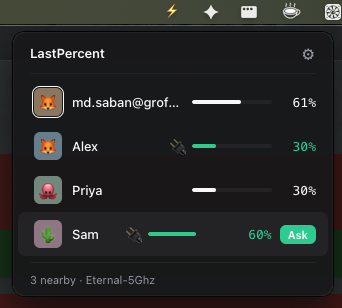
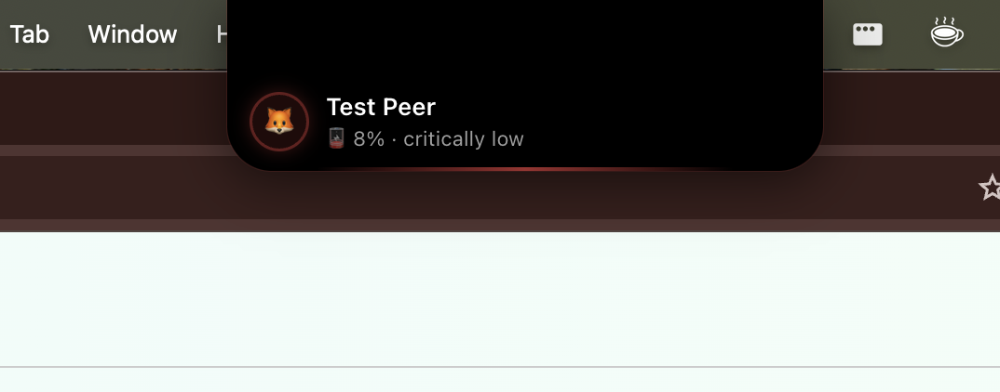
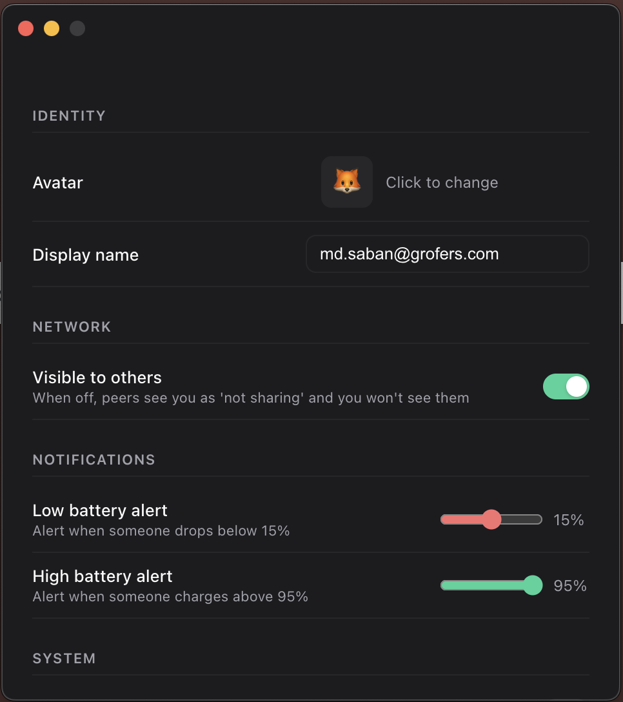

# LastPercent ⚡

A macOS menu bar app that lets teammates on the same Wi-Fi see each other's laptop battery in real time. No cloud, no accounts — everything stays on your local network.


---

## Screenshots

<p align="center">
  
  &nbsp;&nbsp;
  
  &nbsp;&nbsp;
  
</p>

---

## What it does

- **See everyone's battery** — at a glance, who's dying, who's charging
- **Request the charger** — hover over a charging teammate and tap Ask; they get a notch notification
- **Low battery alerts** — Dynamic Island-style nudge when a teammate hits critical
- **High battery alerts** — get notified when someone finishes charging (configurable threshold)
- **Visibility toggle** — go invisible without quitting; peers see you as "not sharing"
- Works over Wi-Fi and Ethernet on the same LAN. No internet required.

---

## Install

Download the latest DMG from [Releases](../../releases):

- `LastPercent-x.x.x-arm64.dmg` → M1/M2/M3/M4 Macs
- `LastPercent-x.x.x.dmg` → Intel Macs (pre-2020)

**Installation steps:**
1. Open the DMG — it mounts like a USB drive
2. Drag `LastPercent.app` into the **Applications** shortcut
3. Eject the DMG
4. Open LastPercent from Applications

**First open:**

macOS will show a _"damaged and can't be opened"_ error because the app isn't code-signed yet. Run this once in Terminal to fix it:

```bash
xattr -cr /Applications/LastPercent.app
```

Then open the app normally from Applications.

> When macOS asks **"Allow 'Electron' to find devices on local networks?"** — click **Allow**. This is the network permission needed to discover teammates. It says "Electron" instead of "LastPercent" until the app is signed.

Look for **⚡** in your menu bar — there's no dock icon.

---

## Uninstall

1. Click ⚡ in the menu bar → ⚙ Settings → turn off **Launch at login**
2. Right-click ⚡ → **Quit**
3. Drag `/Applications/LastPercent.app` to Trash

**Full clean (removes all saved data):**
```bash
rm -rf ~/Library/Application\ Support/lastpercent
```

If you forgot to turn off Launch at login first:  
System Settings → General → Login Items & Extensions → remove LastPercent.

---

## Build from source

See [DEVELOPMENT.md](DEVELOPMENT.md) for the full setup guide including how to test with a single Mac.

```bash
git clone https://github.com/mdsaban/lastpercent
cd lastpercent
npm install
npm run dev       # live dev mode
npm run build     # production build
```

---

## How it works

LastPercent is fully peer-to-peer — no server involved.

| Layer | Technology | Purpose |
|---|---|---|
| Discovery + sync | UDP multicast (`239.255.42.99:41234`) | Battery heartbeats every 8s |
| Storage | electron-store | Local identity + preferences |
| Updates | electron-updater | Auto-update via GitHub Releases |

Each peer broadcasts its own state. No central coordinator. See [PROTOCOL.md](PROTOCOL.md) for the wire format.

---

## Privacy

- **Nothing leaves your LAN.** No servers, no telemetry, no analytics.
- **What's broadcast:** display name, emoji, battery %, charging state, app version.
- **What's not broadcast:** hostname, MAC address, IP address.
- **Opt-out:** Settings → Network → Visible to others → off. You disappear instantly.
- **Trust model:** anyone on your local network running the app can see your state.

---

## Contributing

See [CONTRIBUTING.md](CONTRIBUTING.md).

---

## License

MIT © 2025 mdsaban

---

## ⚠️ Vibe Coded

This app was 100% vibe coded — built entirely with AI assistance, born out of the very real office problem of people forgetting their chargers and spending half the meeting tapping teammates on the shoulder asking "hey what's your battery at?" and "anyone got a charger?" like it's 2009.

No unit tests were harmed in the making of this software. The code works great until it doesn't, at which point we'll vibe fix it.

**Found a bug?** Excellent — you're a beta tester now. Please [open an issue](https://github.com/mdsaban/LastPercent/issues) describing what broke, what you expected, and whether Mercury was in retrograde at the time.
